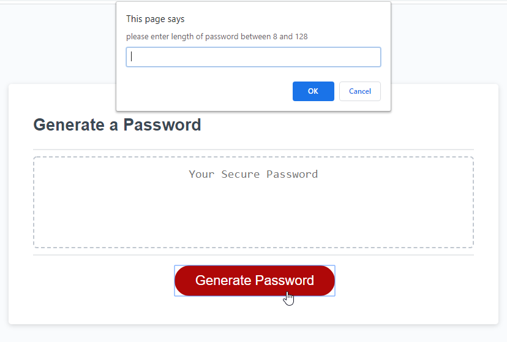
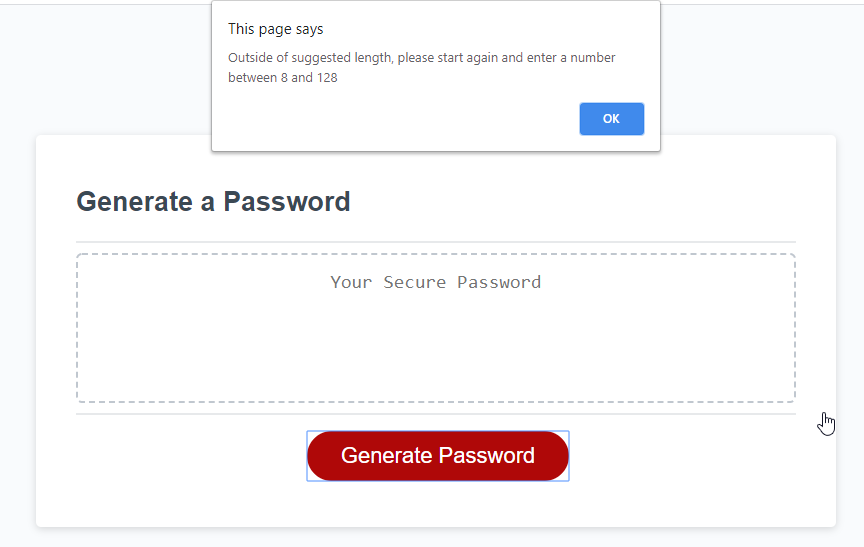
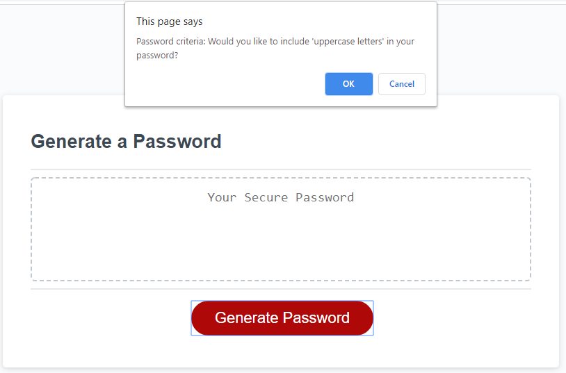
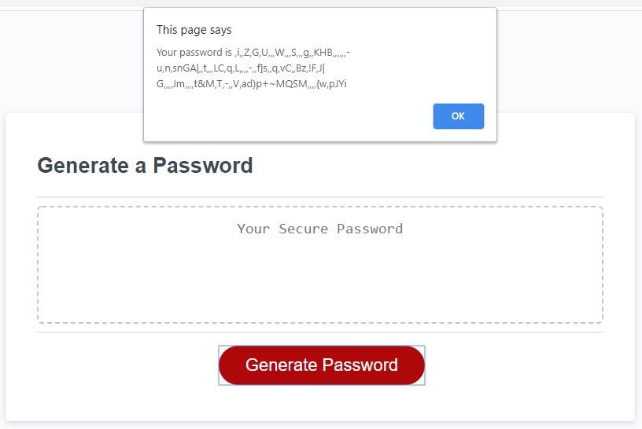

# Password Generator

In accordance to the request, a password generator has been created to provide randomly generated passwords based on the criteria provided by the user. Please use the link below to access the password generator

## Functionalities

For the password generator the following criteria have been met to be able to create a strong password based on user input:

- When 'generate password' is clicked, the user is prompted with several password criteria (see image 1: initial pop up)
- if the minimum requirements are not met or unexpected errors (such as entering a letter when asking for a number), the user will be prompted to ask try again (see image 2: error example)
- The minimum requirements include a password length of 8-128 and at least 1 security criteria selected
- The security criteria prompted will be: lowercase, uppercase, number, and special characters (see image 3: password criteria example)
- once all 5 prompts are answered then a final prompt containing the generated password will appear that meets the previously selected criteria (see image 4: password example)

Access the Password Generator here: [Password Generator URL](https://christofulee.github.io/chris-homework-w3/index)

### image 1: initial pop up

### image 2: error example

### image 3: password criteria example

### image 4: password example
